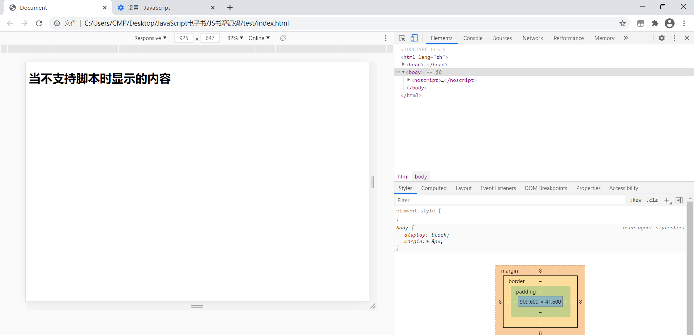

# 一、在HTML中使用JavaScript

[TOC]

## 1. &lt; script >元素

在HTML中插入JavaScript的主要方法就是使用<script>元素，script的六个属性如下：

* async：可选，表示立即下载脚本，但不妨碍页面其他操作。
* charset：可选，表示通过src制定的代码的字符集。
* defer：可选，表示脚本可以延迟到文档完全被解析和显示后再执行。
* language：已废弃，原来用于表示编写代码使用的脚本语言，如JavaScript、JavaScript1.2和VBScript.
* src：可选，表示包含要执行代码的外部文件。
* type：可选，可看作是language的代替属性，默认是text/javascript。


使用<script>元素的方法有两种：

* 直接在页面中嵌入JavaScript。注意在使用时不要在代码的任何地方出现“</script>”字符串，如

  ```js
  alert("</script>")
  ```

  应使用转义字符改为：

  ```js
  alert("<\/script>")
  ```

* 引入外部的JavaScript文件。

  * **需要注意的是，包含src属性的<script>标签，不应在<script></script>中包含额外的JavaScript代码，如果包含了嵌入的代码，则只会下载并执行外部脚本文件，嵌入的代码会被忽略。**
  * src同样也可以引用来自外部域的代码，但是在访问自己不能控制的域的js文件时，要多加小心，怀有恶意的程序员随时可能替换对应的代码。

当<script>不含有async和defer属性时，浏览器会按照先后顺序解析<script>元素。

### 1.1 标签的位置

惯例，一般<script>标签写在<head>中，这样做的目的是把所有外部文件的引用都放在一起，但是当外部js文件过大时，加载会导致浏览器页面显示内容的延迟，降低用户体验；因此，现代web应用一般把JavaScript引用放在<body>中页面内容后面。

### 1.2 defer和async

* defer延迟脚本：这个属性的用途是表明脚本在执行时不影响页面的构造，也就是脚本会延迟到整个页面解析完毕后再运行，设置这个属性，相当于告诉浏览器立即下载，但延迟执行。现实中最好只包含一个延迟脚本。
  * defer属性只适用与外部脚本文件。
  * 把延迟脚本放在页面底部是最佳选择。
* async异步脚本：
  * async一部脚本只适用与外部脚本。
  * 异步脚本告诉浏览器立即下载文件，但不保证按照它们的先后顺序执行。
  * 在异步加载多个外部脚本时，要保证他们不相互依赖。
  * 指定该属性的目的是不让页面等待两个脚本下载和执行，从而异步加载页面其他内容，因此，不建议异步脚本加载期间修改DOM。

## 2.嵌入代码和外部文件

建议使用外部文件来包含JavaScript代码，优点如下：

* 可维护性，集中管理，集中精力编辑JavaScript代码。
* 可缓存，浏览器可以根据具体的设置缓存链接的所有外部JavaScript文件，加快页面加载速度。
* 适应未来。

## 3. &lt; noscript >标签

&lt; noscript >标签可以包含除了 &lt; script >标签外任何可以出现在 &lt; body >中的HTML元素，包含在				 < noscript >中的内容只有在下列情况中才会显示出来：

* 浏览器不支持脚本
* 浏览器支持脚本，但脚本被禁用

在启用了脚本的情况下，浏览器不会显示<noscript>元素中的任何内容。

```html
<!DOCTYPE html>
<html lang="zh">
<head>
    <meta charset="UTF-8">
    <meta name="viewport" content="width=device-width, initial-scale=1.0">
    <title>Document</title>
</head>
<body>
    <noscript>
        <h1>当不支持脚本时显示的内容</h1>
    </noscript>
</body>
</html>
```

在谷歌浏览器中关闭JavaScript后，显示效果如下：


