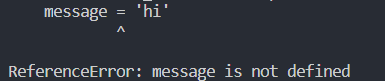
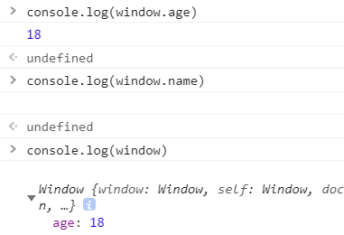

# 二、JavaScript语言基础

[TOC]

## 1.语法

* 区分大小写
* 标识符，及变量、函数、属性或函数参数的名称。
  * 第一个字符必须是字母、下划线或 $ 符号
  * 剩下的字符可以是字母、下划线、 $ 、或数字
  * 按照惯例，ECMAScript标识符使用驼峰大小写形式
* 注释

```js
//单行注释
/*多行注释*/
```

* 语句建议：
  * 语句结束添加分号
  * 控制语句在执行语句时建议用 { } 代码块包裹

## 2.关键字和保留字

如break do in case等。

注意：typeof是关键字，不能当作标识符，但是由于ECMAScript区分大小写，Typeof可以作为标识符。

## 3.变量

ECMAScript变量是松散类型的，有三个关键字可以声明，var、let、const。其中，后面两个只在ECMAScript6及之后的版本可以使用。

### 3.1 var 声明

```js
var message = "hi"
message = 100 //合法，但不推荐
```

上面的语句初始化变量时不会将其标识为字符类型，只是一个简单的赋值，随后，不仅可以改变保存的值，还可以改变值的类型，但不推荐这样使用。

#### 3.1.1 var声明的作用域

使用var操作符定义的变量会成为包含它函数的局部变量，在函数内部定义的变量在函数退出时会被销毁。

**但是，在函数内定义变量时省略var操作符，可以创建一个全局变量。**

```js
function test(){
    var message = 'hi'
}
test()
console.log(message);
```

这样的代码会抛出异常：

但是下面的代码确是正确的：

```js
function test(){
    message = 'hi'
}
test()
console.log(message);
```

ECMAScript 5增加了严格模式（strict mode），该模式下，向上面代码给未声明的变量复制会抛出异常：

启动严格模式，即在文件头部添加：

```js
"use strict"
```

会抛出异常：

* **注意，也可以在一个函数内部添加严格模式，单独指定一个函数在严格模式下执行。**

#### 3.1.2 var声明提升

ECMAScript 运行时会把所有变量声明都拉到函数作用域的顶部。

```js
function foo(){
    console.log(age);
    var age = 18;
}
foo();
```

运行这段代码输出为 undefined，以上代码等价于：

```js
function foo(){
    var age;
    console.log(age);
    age = 18;
}
foo();
```

这就是所谓的提升。

反复使用var声明同一个变量也没有问题。

### 3.2 let声明

* **let声明的范围是块作用域**，区别于var的函数作用域。

```js
//块作用域报错——age is not defined.
if(true){
    let age = 18;
}
console.log(age);
```

以上代码会报错，age is not defined.

块作用域是函数作用域的子集，因此，var作用域的限制同样适用于let。

* **let不允许同一个块作用域出现冗余声明**

```js
//冗余声明报错——Identifier 'age' has already been declared
if(true){
    let age = 18;
    let age = 20;
    console.log(age);
}
```

* 嵌套适用相同的标识符不会出错，这是因为一个块中没有重复声明，如下：

```js
let age = 30;
console.log(age);
if(true){
    let age = 26;
    console.log(age);
}
//运行结果：
//30
//26
```

* var和let声明的并不是不同类型的变量，他们只是指出了变量在相关作用域如何存在。

```js
//报错——SyntaxError: Identifier 'name' has already been declared
let name;
var name;
```

#### 3.2.1 暂时性死区

**let声明的变量不会在作用域被提升**

```js
//报错——ReferenceError: Cannot access 'age' before initialization
console.log(age)
let age;
```

#### 3.2.2 全局声明

let全局声明的关键字不会成为 window 的属性，与之相反，var声明的关键字则会。

```js
var age = 18;
let name = 'cmp';
```

浏览器调试结果如图

#### 3.2.3 条件声明

let作用域是块，所以不可能检查前面是否已经使用let声明过同名变量，同时也就不可能在没有声明的情况下声明它。使用try/catch语句或者typeof操作符也不能解决。

```js
if(typeof name === undefined){
    let name;
}
name = 'cmp'
console.log(name); //'cmp'
```

上述代码 name 被限制在if{}块里面，因此这个赋值等同于全局赋值。

#### 3.2.4 for循环中的let声明

在let出现之前，for循环中定义的迭代变量会渗透到循环体外部，改成使用let后，这个问题就消失了。

```js
//输出结果 5，5，5，5，5
for(var i = 0;i<5;i++){
    setTimeout(() => {
        console.log(i);
    },0)
}

//输出结果 0，1，2，3，4
for(let i = 0;i<5;i++){
    setTimeout(() => {
        console.log(i);
    },0)
}
```

### 3.3 const声明

const的行为与let基本相同，一个重要的区别就是用它声明变量时必须同时初始化变量，且尝试修改const声明的变量时会出错。

* const也不允许重复声明，const声明的作用域也是块。
* const声明的限制只适用于它指向变量的引用，如果const变量引用的是一个对象，那么修改对象内部的属性并不会发生错误。

```js
const person = {}
person.age = 18;
console.log(person.age); //18
```

* const不能声明迭代变量，因为迭代变量会自增。
* const声明和for-of以及for-in可以配合使用。

```js
for(const value of [1,2,3,4,5]){
    console.log(value);
}
//1,2,3,4,5
```

上面，const声明的是一个不会被修改的for循环变量，每次迭代都只是创建一个新变量。

### 3.4 声明风格建议

* 不使用var
* const优先，let次之

## 4.数据类型

ECMAScript有6种简单的数据类型：Undefined、Null、Boolean、Number、String和Symbol，Symbol是ECMAScript新增的。还有一种复杂的数据类型叫Object，Object是一种无序键值对集合。

### 4.1 typeof操作符

使用typeof操作符会返回下列字符串之一：

undefined、boolean、string、number、object、function、symbol

需要注意的是：

* **返回object表示值为对象（不是函数）或者null**，null被认为是一个空对象的引用
* ECMAScript中，严格来说，函数被认为是对象，并不代表一种数据类型，可是函数也有自己特殊的属性，因此，有必要通过typeof来区分函数和其他对象

### 4.2 Undefined类型

* Undefined类型只有一个值，那就是undefined。当使用var或let声明了变量但没有初始化时，就相当于给了变量undefined值。

* 字面量undefined主要用于比较，明确空对象指针（null）和未初始化变量的区别
* 包含undefined值的变量和未定义的变量有区别

```js
let message;
console.log(message); //undefined

console.log(age); //报错：age is not defined
```

* 对于未声明的变量，只能执行一个有用的操作，那就是对他调用typeof

```js
console.log(typeof age); //undefined
```

* undefined是一个假值，如果需要，可以以更加简洁的方式检测它，比如用if条件

### 4.3 Null类型

* Null同样只有一个值，那就是null。null是一个空对象指针
* undefined值是由null派生的，因此他们定义未表面上相等

```js
console.log(null == undefined); //返回true
```

* 如前所述，永远不必显式给变量设置undefined，但null不是这样，任何时候，只要变量要保存对象，而当时又没有那个对象可保存，就要用null来填充该变量，这样就可以保持null空对象指针的含义，并进一步与undefined区分
* null是一个假值

### 4.4 Boolean类型

* Boolean有两个字面值：true和false，这两个值不同于数值，因此true不等于1，false不等于0
* true和false是区分大小写的，因此True和False可以作为标识符
* Boolean有两个值，但其他所有类型的值都有对应的Boolean的等价形式，可以调用Boolean()函数来进行类型转换

### 4.5 Number类型

* Number最基本的数值字面量是十进制整数，直接写出来即可，如55
* 整数也可用八进制或十六进制字面量表示
  * 八进制字面量的第一个数字必须是0，然后是相应的八进制数字
  * 十六进制的数值前缀是 0x（区分大小写），然后是十六进制数字
  * 八进制和十六进制格式创建的数值在所有的数学操作中都被视为十进制数值

#### 4.5.1 浮点值

定义浮点值，数值中必须加上小数点，而且小数点后面必须至少有一个数字

* 因为存储浮点值所用的内存空间是整数值的两倍，所以ECMAScript总是想方设法把值转换为整数，因此在小数点后没有数字的情况下，数值会变为整数；类似的，如果数值本身就是整数，只是小数点后面跟着0，也会被转换为整数
* 科学计数法：一个数值（整数或浮点数）后跟一个大写或小写的e，再加上一个要乘的10的多少次幂
* 浮点值的精确度最高可达17位小数，但在算术计算中远不如整数精确，所以永远不要测试某个特定的浮点数

```js
if(0.1 + 0.2 == 0.3){
    console.log(true);
}
else{
    console.log(false);
}
//输出false
```

#### 4.5.2 值的范围

* ECMAScript可以表示的最小的数值：Number.MIN_VALUE
* ECMAScript可以表示的最大的数值：Number.MAX_VALUE
* 超出ECMAScript数值范围的数标识为Infinity和-Infinity
* Number.NEGATIVE_INFINITY和Number.POSITIVE_INFINITY也可以获取正负无穷，这两个属性包含的值就是-Infinity和Infinity

#### 4.5.3 NaN

有一个特殊的数值：NaN，即not a number，用于表示本来要返回数值的操作失败了（不是抛出错误）

* 0、=0、-0相除会返回NaN
* 如果分子是非0值，分母是有符号0或无符号0，会返回Infinity或-Infinity
* 任何涉及NaN的操作符始终返回NaN
* NaN不等于包括NaN在内的任何值

```js
console.log(NaN == NaN); //返回false
```

* isNaN()函数用于判断参数是否是NaN

#### 4.5.4 数值转换

三个函数：Number()、parseInt()、parseFloat()

其中，Number()是转型函数，可用于任何数据类型；其余两个主要用于将字符串转换为数值

* Number()：
  * null返回0，undefined返回NaN
  * 字符串：数值字符、浮点值、十六进制、空字符串转换位数值，其他返回NaN
  * 对象：先调用valueOf()方法，再按上述规则转换返回的值
* parseInt()、parseFloat() [只解析十进制数值] **重要**

### 4.6 String类型

* 字符字面量
* 字符串特点：字符串是不可变的
* 转换为字符串：
  * toString()
  * String()
* 模板字面量
* 字符串插值
* 模板字面量的标签函数
* 原始字符串：String.raw``

### 4.7 Symbol类型

符号是原始值，且符号实例是唯一的、不可变的。

符号的用途是确保对象属性使用唯一标识，不会发生属性冲突的危险

符号就是用来创建唯一记号，进而用作非字符串形式的对象属性

* 符号没有字面量语法，这也是它发挥作用的关键
* Symbol()函数不能用作构造函数，与new关键字一起使用，这样避免创建符号包装对象
* 如果运行时的不同部分需要共享和重用符号实例，可以用一个字符串作为键，在全局符号注册表中创建并重用符号，需要使用Symbol.for()方法
* Symbol.keyFor()方法可以查询全局注册表，用这个方法接收符号，返回该全局符号对应的字符串键，如果查询的不是全局符号，返回undefined；如果传的参数不是符号，会报错

### 4.8 Object类型

对象其实就是一组数据和功能的集合，对象通过new操作符后跟对象类型的名称来创建。

## 5操作符

### 5.1一元操作符

#### 5.1.1递增/减操作符

递增（++）

递减（--）

注意 前缀 写法和 后缀 写法：

* 前缀写法代表：变量的值在语句被求值之前改变
* 后缀写法代表：变量的值在语句被求值之后改变

例子如下：

```js
let num1 = 1;
let num2 = 2;
let num3 = --num1 + num2
console.log(num3); //2

let num4 = 1;
let num5 = 2;
let num6 = num4-- + num5
console.log(num6); //3
```

此外，该操作符不限于整数运算，字符串、布尔值、浮点值，甚至对象都可以使用

#### 5.1.2一元加和减

当将一元加减应用到非数值，则会执行和使用Number()转型函数一样的类型转换。

### 5.2位操作符

存储按照64位存储，但运算按照32位运算，其中一位为符号位，表示数值的正负。

* 负值以 二补数 的二进制编码存储
  * 确定绝对值的二进制表示
  * 找到数值的补数
  * 给结果加1
* 把负值输出为一个二进制字符串，会得到一个加了减号的绝对值
* 特殊值NaN，Infinity在位操作中都会被当成0处理
* 将位操作用于非数值，首先会使用Number()函数将该值转换为数值

#### 5.2.1 按位非 ~

* 返回数值的补数

* 最终结果是数值取反再加一

#### 5.2.2 按位与 &

#### 5.2.3 按位或 |

#### 5.2.4 按位异或 ^

#### 5.2.5 左移 <<

#### 5.2.6 有符号右移 >>

#### 5.2.7 无符号右移 >>>

* 对于正数，无符号右移和有符号右移结果一样
* 对于负数，相差很大

### 5.3布尔运算符

#### 5.3.1逻辑非 ！

这个操作符返回布尔值，无论应用到什么数据类型，逻辑非首先将操作数转换为布尔值，然后再对其取反

* 操作数是对象，返回false
* 是空字符串，返回true
* 是非空字符穿，返回false
* 是数值0，返回true
* 是非0数值，返回false
* 是null，返回true
* 是NaN，返回true
* 是undefined，返回true

逻辑非操作也可以用于把任何值转换为布尔值同时使用两个！！，相当于调用Boolean()

#### 5.3.2逻辑与 &&

逻辑与操作符适用于任何类型，如果有操作数不是布尔值时，则逻辑与不一定返回布尔值

* 如果第一个操作数是对象，则返回第二个操作数
* 如果第二个都是对象，则，只要第一个操作数求值为true才会返回该对象
* 如果两个操作数都是对象，则返回第二个操作数
* 如果有一个操作数是null，则返回null
* 如果有一个操作数是NaN，则返回NaN
* 如果有一个是undefined，则返回undefined

逻辑与操作符是一种短路操作符，即如果第一个操作数决定了结果，那么永远不对第二个操作数求值

#### 5.3.3逻辑或 ||

逻辑或操作符适用于任何类型，如果有操作数不是布尔值时，则逻辑与不一定返回布尔值

* 如果第一个操作数是对象，则返回第一个操作数
* 如果第一个操作数求值是false，则返回第二个操作数
* 如果两个操作数都是对象，则返回第一个操作数
* 如果有一个操作数是null，则返回null
* 如果有一个操作数是NaN，则返回NaN
* 如果有一个是undefined，则返回undefined

逻辑或操作符是一种短路操作符，即如果第一个操作数决定了结果，那么永远不对第二个操作数求值

### 5.4乘性操作符

* 乘法*
* 除法/
* 取模（余数）%

### 5.5指数操作符

ECMAScript 7新增了指数操作符，Math.pow()有了自己的操作符**

指数操作符也有自己的指数赋值运算符 **= 

### 5.6加性操作符

#### 5.6.1 加法操作符

如果有一个操作数是字符串，则应用如下规则：

* 如果两个都是字符串，则将第二个字符串拼接到第一个字符串后面
* 如果只有一个操作数是字符串，则将另一个操作数转换为字符串，在将两个字符串拼接在一起

* 如果任一操作数是对象、布尔值、数值，则调用他们的toString()方法获取字符串，然后应用前面关于字符串的规则
* 对于undefined和null，则调用String()方法，分别获取undefined和null

使用加法操作，要注意数据类型：

```js
let num1 = 5;
let num2 = 10;
let message = 'The sum of 5 and 10 is ' + num1 + num2;
console.log(message) //The sum of 5 and 10 is 510

let num1 = 5;
let num2 = 10;
let message = 'The sum of 5 and 10 is ' + (num1 + num2);
console.log(message) //The sum of 5 and 10 is 15
```

#### 5.6.2减法操作符

* 如果任一操作数是字符串、布尔值、null或undefined，则先在后台使用Number()将其转换为数值，然后再根据前面的规则执行数学运算，如果转换的结果是NaN，则计算结果也是NaN
* 如果有任一操作数是对象，则调用其valueOf()方法获取它的数值，如果对象没有valueOf()方法，则调用其toString()方法，然后将得到的字符串转换为数值

### 5.7关系操作符

关系操作符包括小于<、大于>、小于等于<=、大于等于>=，这几个操作符都返回布尔值

应用到其他类型时：

* 如果操作数都是数值，则进行数值比较
* 如果操作数都是字符串，则逐个比较字符串中对应字符的编码
* 如果有任一操作数是数值，则将另一个操作数转换为数值，执行数值比较
* 如果任一操作数是对象，则调用其valueOf()方法，没有该方法则调用toString()方法
* 如果任一操作数是布尔值，则将其转换为数值在执行比较
* 任何关系操作符在涉及比较NaN时，都返回false

```js
console.log('23' < '3') //true

console.log('23' < 3) //false
```

### 5.8相等操作符

ECMAScript提供两组操作符，第一组时等于和不等于，他们在比较之前执行类型转换；第二组时全等和不全等，他们比较执行之前不执行转换

#### 5.8.1等于和不等于

* 等于（==）
* 不等于（!=）

在进行转换操作数的类型时，相等和不相等操作符遵循的规则如下：

* 任一操作数是布尔值，则将其转换为数值再进行比较
* 任一操作数是字符串，另一个操作数是数值，则尝试将字符串转换为数值，再进行比较
* 如果一个操作数是对象，另一个不是，则调用valueOf()方法取得原始值，再进行比较
* null和undefined相等
* null和undefined不能转换为其他类型再进行比较
* 如果任一操作数是NaN，则相等操作符返回false，不等操作符返回true
* 如果两个操作数都是对象，则比较他们是不是同一个对象，如果两个操作数都指向同一个对象，则相等操作符返回true，否则，两者不相等

#### 5.8.2全等和不全等

* 全等（===）
* 不全等（!==）

```js
console.log('55' == 55); //true
console.log('55' === 55) //false
console.log(null === undefined) //false
```

全等和不全等不转换操作数类型，进行比较。

### 5.9条件操作符

```js
let num1 = 5;
let num2 = 10;
let max = (num1 > num2) ? num1 : num2;
console.log(max)  //10
```

### 5.10赋值操作符

简单赋值使用等号（=），将右边的值赋给左边的值；

复合赋值使用乘性、加性或位操作符后跟等号表示：

```js
let num1 = 10;
let num2 = 10;
num1 = num1 +10;
num2 += 10;
console.log(num1); //20
console.log(num2); //20
```

复合操作符只是简写语法，不会提高性能

### 5.11逗号操作符

逗号操作符可以用来在一条语句中执行多个操作

在赋值时使用逗号操作符分隔值，最终会返回表达式最后一个值：

```js
let num = (5,4,3,2,1);
console.log(num) //1
```

## 6语句

### 6.1 if语句

条件可以时任何表达式，并且求值结果不一定是布尔值，ECMAScript会自动调用Boolean()函数将这个表达式的值转换位布尔值

### 6.2 do-while语句

该语句是一种后测试循环语句，即循环体中的代码执行后才会对推出条件进行求值。换句话说，循环体内的代码至少执行一次。

```js
let num = 2;
do{
    num += 2;
}while(false)
console.log(num) //4
```

### 6.3 while语句

该语句是一种先测试循环语句，即先检测推出条件，再执行循环体内的代码，因此，循环体的代码有可能不执行。

### 6.4 for语句

for语句也是先测试语句，只不过增加了进入循环前的初始化代码，以及循环执行后要执行的表达式

### 6.5 for-in语句

* for-in语句是一种严格的迭代语句，用于枚举对象中非符号键属性

* ECMAScript中对象的属性是无序的，因此该语句不能保证返回对象属性的顺序

* 如果要迭代的变量是null或者undefined，则不执行循环体

### 6.6 for-of语句

* for-of语句是一种严格迭代语句，用于遍历可迭代对象的元素

* for-of对象会按照可迭代对象的next()方法产生值的顺序迭代元素

### 6.7标签语句

标签语句用于给语句加标签，可以通过break或者continue语句引用，标签语句的典型应用场景是嵌套循环

### 6.8 break和continue语句

* break语句用于立即跳出循环，强制执行循环后的下一条语句
* continue语句也用于立即退出循环，但会再次从循环顶部开始执行

break和continue都可以和标签语句一起使用，返回代码中特定的位置

### 6.9 with语句

with语句的作用是将代码作用域设置为特定的对象

使用with语句的主要场景是针对一个对象反复操作，这时候代码作用域设置为该对象能提供便利

```js
let qs = location.search.substring(1)
let hostName = location.hostname
let url = location.href

//可以写为
with(location){
    let qs = search.substring(1)
    let hostName = hostname
    let url = href
}
```

这里，with用于连接location对象。这意味着在这个语句内部，每个变量首先会被认为是一个局部变量。如果没有找到该局部变量，则会搜索location对象，看它是否有一个同名的属性，如果有，则该变量会被求值为location对象的属性

* 由于with语句影响性能且难于调试其中的代码，不建议使用

### 6.10 switch语句

流控制语句

* 为了避免不必要的条件判断，最好给每个条件后面都加上break语句
* 该语句可以用于所以数据类型
* 条件的值不需要是常量，也可以是变量或表达式
* switch语句在比较每个条件的值时会使用全等操作符，因此不会强制转换数据类型

## 7函数

* ECMAScript中的函数不需要指定是否返回值，任何函数在任何时候都可以使用 return语句来返回函数的值
* 除了return语句之外没有任何特殊声明表明函数有返回值
* 函数只要碰到return语句，函数就会立即停止执行并推出
* return语句也可以不带返回值，这时候函数会立即停止执行并返回undefined。这种用法常用于提前终止函数执行


严格模式对函数也有一些限制：

* 函数不能以eval或arguments作为名称
* 函数参数不能叫eval或argument
* 两个函数的参数不能叫同一个名称